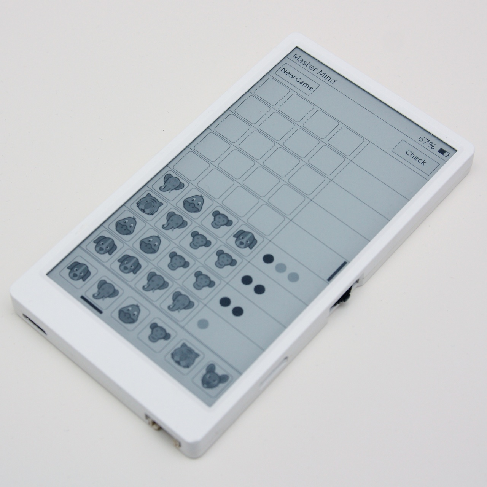
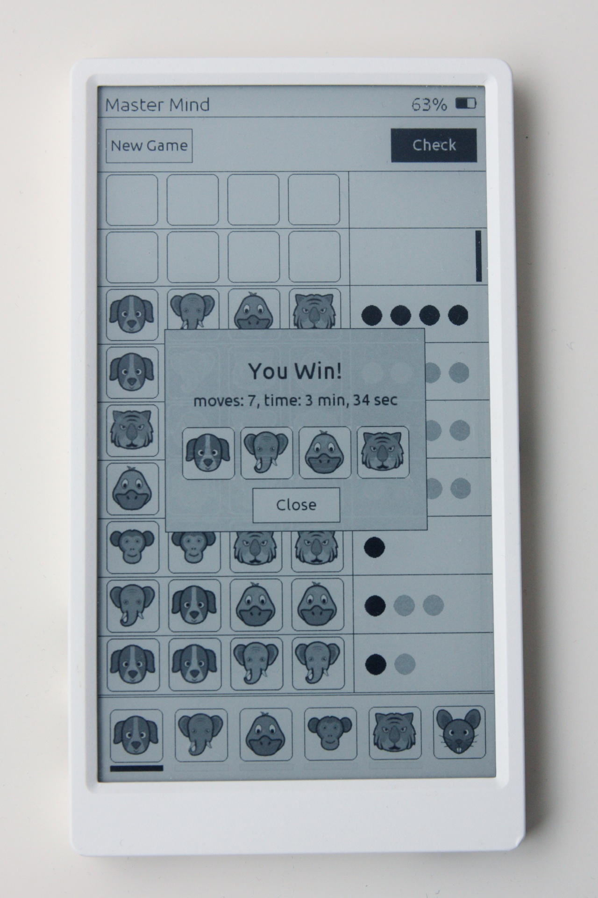

# M5Paper_MasterMind
A MasterMind game for the M5Paper device form [M5Stack](https://docs.m5stack.com/en/core/m5paper).

 

# Build Instructions
1. Install the board management in the Arduino IDE ([M5Stack](https://docs.m5stack.com/en/arduino/arduino_board))
2. Install the M5Stack development library kit for Arduino ([M5EPD](https://docs.arduino.cc/libraries/m5epd/))
3. Load the sketch MasterMind.ino in the Arduino IDE
4. Select the device M5Paper and the corresponding COM port
5. Build and upload the sketch

# Usage
Press the button "New" on the top bar to start a new game, a new random code is generated. First click an image to select it and then click the destination place on the active guess row. The selected image and the active row are indicated with a black bar. When a code row is completed press the "Check" button, the key pegs (black and white) are shown to the right of the row. A black key peg is placed for each image of the guess which is correct in both image and position, a white key peg indicates an image that is present in the solution, but is incorrectly positioned.

# License
This program is licensed under MIT.

# Thanks
Thanks to Thiago Silva for the beautiful [animal icons](https://www.iconfinder.com/iconsets/animals-105)
